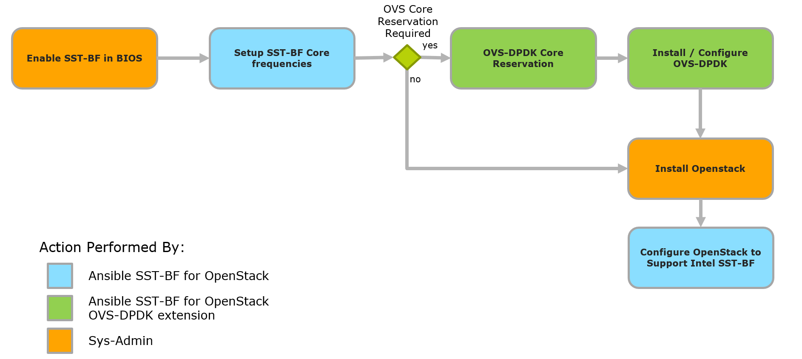

# Intel® Speed Select - Base Frequency for Openstack - Setup Automation
The code herein allows a data center administrator or high-level orchestration tool to use Ansible\* for provisioning Openstack\* Nova compute servers with Intel® Speed Select - Base Frequency feature. Please read [Intel® Speed Select Technology – Base Frequency Configuration Automation on OpenStack* Compute Host](https://builders-staging.onsumaye.com/docs/networkbuilders/intel-speed-select-technology-base-frequency-configuration-automation-on-openstack-compute-host.pdf) Application note for more detailed information.

Intel® SST-BF is a CPU feature designed to unlock software bottlenecks. For the same Thermal Design Power (TDP), a subset of cores have different frequency profiles depending on the profile selected with this Ansible\* role. A subset of cores run at higher core frequencies and this configuration presents an opportunity to address many use cases, including:
* Network Function Virtualization (NFV) Data Plane, Control Plane and Open vSwitch\* (OVS) use cases
* Pipeline software architectures
* Frequency bound workloads such as software based crypto
* Priority threads for run to completion such as unbalanced downlink or uplink threads
* Packet distribution and workload distribution in software
* Scenarios where polling user space drivers can be consolidated

This Ansible* role covers the following aspects of Intel® SST-BF provisioning, configuration and usage on an Openstack\* Nova compute node:
* Configuring platform nodes by setting the CPU to the right frequency boundaries via direct CPU interaction using the Kernel file system (sysfs).
* Configuring OpenStack\* to provide tenants with the option to request and provision workloads on cores configured with different frequency levels.
* Presenting an automation process usage example of a particular OVS-DPDK use case: Pinning OVS-DPDK to a set of cores on a node running OpenStack\* compute process and sharing the CPU with virtualized workloads.

This Ansible\* role is focused on Openstack\* but can also be ultilised to provision nodes with SST-BF for other orchestrators such as Kubernetes\*.

## Provisioning Automation Flow
The following diagram describes how to take an existing Ansible\* Playbook for a resource orchestrator (e.g Openstack\*) and insert this role into an Ansible\* Playbook to perform the required automation.


|  Activity|Description  |
|--|--|
|  Enable Intel® SST-BF in BIOS| Initial step required from the System Administrator to change the BIOS configuration as specified in section 3.2 of document [Intel® Speed Select - Base frequency enhancing performance](https://builders.intel.com/docs/networkbuilders/intel-speed-select-technology-base-frequency-enhancing-performance.pdf) |
| Set up Intel® SST-BF Core frequencies | Initial automated step to set up core configuration to get high and normal priority frequencies as identified by the kernel driver in sysfs. Frequency configuration is achieved using [Python SST-BF configuration script](https://github.com/intel/CommsPowerManagement).
| Configure OVS-DPDK Core Reservation | Before proceeding to the OVS-DPDK installation and configuration, it is required to reserve either high or normal priority cores and pin them to an OVS-DPDK process. (Optional step)
| Install OVS-DPDK | OVS-DPDK installation (optional) and configuration is completed during this step. Note: OVS-DPDK is not installed by default during an OpenStack\* installation process. This step is provided to ease the OVS-DPDK installation and configuration process as part of this flow. (Optional step)
| Install OpenStack\* | OpenStack\* is installed by the System Administrator using either an automation set or manual steps.
| Configure OpenStack\* to support Intel® SST-BF | The Intel® SST-BF configuration with the identification of high and normal priority tiers will be appended to the OpenStack\* Nova configuration file provisioned by the OpenStack\* installation mechanism on the compute node. The Openstack\* Custom-Traits configuration to the node and the creation of the flavors related to the specific cloud configuration is done as part of this activity.

## Openstack*: Exposing and Using the Intel® SST-BF feature
This role configures Openstack* by adding a custom trait “CUSTOM_CPU_X86_INTEL_SST_BF" to show a Nova compute node is SST-BF capable to the placement database. There are four SST-BF profiles from which to choose from which indicate which SST-BF profile has been applied to the targeted Nova compute node.

### Standardize CPU resource tracking
A mechanism to split the pool of cores in Openstack\* is defined in blueprint ["Standardize CPU resource tracking"](https://blueprints.launchpad.net/nova/+spec/cpu-resources). The mechanism uses the following two resource classes defined for placement API:
- PCPU to represent dedicated CPU cores
- VCPU to represent CPU cores that can be shared by multiple workloads

This resource tracking mechanism introduced in Openstack\* Train allows the Cloud Admin to define:
- which host cores should be used for dedicated workloads (exclusive core pinning for critical execution)
- which host cores should be used for shared workloads (time sharing core cycles between independent workloads)

On the CPU, the SST-BF functionality allows you to setup the frequencies of the CPU cores to operate on different tiers, optimize the overall power consumption, critical workload throughput, and also create deterministic frequency boundaries on the CPU cores. The two features (Intel® SST-BF and Openstack\* CPU resource tracking) can be combined to allow the Cloud Admin to setup the Openstack\* core classification, match the dedicated list of cores to either high or normal frequency tiers and match the shared list of cores to either high or normal frequency tiers optionally subtracting any cores allocated to OVS-DPDK.

The core distribution ratio for the shared cores is defined by `cpu_allocation_ratio` Ansible\* variable (float).
Nova configuration file variables configured:

| Nova Variable         | Description           |
|-----------------------|-----------------------|
| cpu_dedicated_set     | Dedicated CPU cores   |
| cpu_shared_set        | Shared CPU cores      |
| cpu_allocation_ratio  | VCPU allocation ratio |

The following demonstrates the SST-BF CPU capable trait and four SST-BF profile frequency configuration traits:


### Sample Openstack\* Ansible\* Playbook
Setup Openstack\* Nova compute with SST-BF and configure Openstack\* sample playbook:
```ansible
- name: Configure SST-BF for Openstack
  hosts: nova_compute
  gather_facts: yes
  user: root
  tasks:
      - name: Set and get SST-BF
        include_role:
          name: "sst_bf_openstack_setup_automation"

# [ Insert role to install Openstack Nova Compute here ]
# Openstack Nova compute must be installed before running the next task

      - name: Configure Openstack for SST-BF
        vars:
          OS_USERNAME: admin
          OS_PASSWORD: admin
          OS_AUTH_URL: https://192.168.1.1
          OS_PROJECT_NAME: default
          OS_USER_DOMAIN_ID: default
          OS_PROJECT_DOMAIN_ID: demo
          configure_os_only: true
        include_role:
          name: "sst_bf_openstack_setup_automation"
```

## SST-BF Profile
The Ansible\* variable `sst_bf_profile` defines which SST-BF configuration to apply to the Openstack\* Nova compute node. It also denotes how each frequency priority level is mapped to Openstack\* Nova's `cpu_dedicated_set` & `cpu_shared_set` variables.
The following values are options for `sst_bf_profile`:

### FREQUENCY_FIXED_HIGH_DEDICATED
The `cpu_dedicated_set` holds the list of cores set to high priority frequency.
- Min and Max boundary are set to the high BF tier.

The `cpu_shared_set` holds the list of cores set to normal priority frequency.
- Min and Max boundary are set to the normal BF tier

### FREQUENCY_FIXED_HIGH_SHARED
The `cpu_dedicated_set` holds the list of cores set to normal priority frequency.
- Min and Max boundary are set to the normal BF tier.

The `cpu_shared_set` holds the list of cores set to high priority frequency.
- Min and Max boundary are set to the high BF tier

### FREQUENCY_VAR_HIGH_DEDICATED
The `cpu_dedicated_set` holds the list of cores set to high priority frequency.
- Min boundary is set to a given minimum CPU frequency. (Depends on SKU reference and recommended configuration.)
- Max boundary is set to the high BF tier.

The `cpu_shared_set` holds the list of cores set to normal priority frequency.
- Min boundary is set to a given minimum CPU frequency. (Depends on SKU reference and recommended configuration.)
- Max boundary is set to the normal BF tier.

### FREQUENCY_VAR_HIGH_SHARED
The `cpu_dedicated_set` holds the list of cores set to normal priority frequency.
- Min boundary is set to a given minimum CPU frequency. (Depends on SKU reference and recommended configuration.)
- Max boundary is set to the normal BF tier.

The `cpu_shared_set` holds the list of cores set to high priority frequency.
- Min boundary is to a given minimum CPU frequency. (Depends on SKU reference and recommended configuration.)
- Max boundary is set to the high BF tier.

## Role Variables
| Variable                | Default                         | Description                                                                          |
|-------------------------|---------------------------------|------------------------------------------------------------------------------------- |
| configure_os_only       | false                           | When true, Openstack\* is installed on the target. Environment variables for OS_USERNAME, OS_PASSWORD, OS_AUTH_URL, OS_PROJECT_NAME, OS_USER_DOMAIN_ID and OS_PROJECT_DOMAIN_ID are required environment variables for logging into Openstack\* when this option is set to true                           |
| nova_conf_path          | /etc/nova/nova-cpu.conf         | Nova Configuration file location                                                     |
| restart_nova            | true                            | Option to restart nova after configuration changes                                   |
| nova_service_name       | devstack@n-cpu.service          | Systemctl Nova service name for restarting after configuration file changes          |
| skip_ovs_dpdk_config    | true                            | Skip OpenvSwitch*-DPDK                                                               |
| ovs_dpdk_installed      | true                            | If an existing installation of OpenvSwitch*-DPDK exists or not before executing this role  |
| ovs_core_high_priority  | true                            | If true then pin high priority cores to PMD otherwise choose normal priority  cores  |
| ovs_dpdk_nr_1g_pages    | 16                              | Number of 1 GB hugepages to reserve for DPDK                                         |
| ovs_dpdk_nr_2m_pages    | 2048                            | Number of 2 MB hugepages to reserve for DPDK                                         |
| ovs_dpdk_driver         | vfio-pci                        | Driver to bind to NIC                                                                |
| ovs_service_name        | openvswitch-switch              | Systemctl service name for OpenvSwitch*                                              |
| dpdk_service_name       | dpdk                            | Systemctl service name for DPDK                                                      |
| ovs_datapath            | netdev                          | Userspace datapath type for OpenvSwitch* bridge creation                             |
| ovs_dpdk_interface_type | dpdk                            | Interface type for DPDK                                                              |
| offline                 | false                           | Air-gapped deployment. Clone/copy [CommsPowerManagement](https://github.com/intel/CommsPowerManagement) to /tmp of Nova compute target if true     |
| sst_bf_profile          | FREQUENCY_FIXED_HIGH_DEDICATED  | Contains a set of values that control which Intel® SST-BF profile we apply to the target host. The possible values are:<br> * FREQUENCY_FIXED_HIGH_DEDICATED<br> * FREQUENCY_FIXED_HIGH_SHARED<br> * FREQUENCY_VAR_HIGH_DEDICATED<br> * FREQUENCY_VAR_HIGH_SHARED<br>This will be translated to the corresponding traits:<br> * CUSTOM_CPU_FREQUENCY_FIXED_HIGH_DEDICATED<br> * CUSTOM_CPU_FREQUENCY_FIXED_HIGH_SHARED<br> * CUSTOM_CPU_FREQUENCY_VAR_HIGH_DEDICATED<br> * CUSTOM_CPU_FREQUENCY_VAR_HIGH_SHARED |
| cpu_allocation_ratio    | 1.0                            | Core distribution ratio for shared cores (vCPUs)                                     |

A description of the target node is needed if you are configuring or installing OpenvSwitch*-DPDK.

### Sample host description
```
host_description:
  numa_nodes:
    0:
      interfaces:
        eno1:
          pci_address: "0000:3d:00.0"
      dpdk_socket_mem: 1024
      no_physical_cores_pinned: 4
    1:
      dpdk_socket_mem: 1024
      no_physical_cores_pinned: 2
  bridge_mappings:
    ovs-brnew: 'eno1'
```
### Ansible\* variable `host_description` key's description
| Value                    | Required definition | Description                                                                                                                                                                                     |
|--------------------------|---------------------|-------------------------------------------------------------------------------------------------------------------------------------------------------------------------------------------------|
| host_description         | yes                 | Description of target node's assets needed to configure OpenvSwitch*-DPDK                                                                                                                       |
| numa_nodes               | yes                 | Description of target NUMA nodes describing interfaces, socket memory and number of physical cores to pin to PMD. numa_nodes dictionary must contain one or more NUMA nodes                     |
| interfaces               | no                  | One or more interfaces need to be defined if interfaces are defined. This information will be leveraged to build bridges which will bind to an interface. This dict will contain key value pairs. The key is the interface name |
| pci_address              | no                  | A PCI address for a given interface and it needs to be defined if an interface is defined in bridge_mappings                                                                                    |
| dpdk_socket_mem          | yes                 | DPDK allocated socket memory                                                                                                                                                                    |
| no_physical_cores_pinned | yes                 | Number of physical cores to pin to associated NUMA node                                                                                                                                         |
| Bridge_mappings          | yes                 | Bridge definition for DPDK including one or more key-value 'bridge name (key) - (value) interface name' definitions. An interface defined here must have an associated definition in numa_nodes |

Ansible\* variable `no_physical_cores_pinned` denotes the amount of physical cores you wish to pin to DPDK's PMD.
lcore or library core is pinned to a user defined number of logical core(s) (thread).

## Requirements
- Server with Speed Select - Base Frequency functionality (e.g Intel® Xeon® 5218N / 6230N / 6252N )
- Linux\* kernel >= 5.1
- Python >= 3.5
- Ansible\* >= 2.5
- Openstack\* Train or greater

## OpenvSwitch-DPDK\* Optimisation using SST-BF (Optional flow)
An optional task for this role is to configure OpenvSwitch* with DPDK either with an existing installation present or installation from the distributions repositories.
This role allows DPDK to utilize and isolate either high or normal priority cores for DPDK's poll mode driver (PMD). The user can specify the amount of physical cores to pin to PMD on each NUMA node. The physical cores pinned to PMD will be isolated from kernel processes ( host restart required ) and Openstack's\* provisioning of virtual machines. A user defined number of threads of normal priority is pinned to DPDK's lcore.

Set `skip_ovs_dpdk_config` to true if you wish to skip configuring OVS-DPDK completely.
If you have previously installed OVS-DPDK prior to running this Ansible\* Role and wish to pin either high or normal priority cores to DPDK's poll mode driver, then set `ovs_dpdk_installed` to true.
If you wish to install OVS-DPDK from your distribution supported repositories then set `ovs_dpdk_installed` to false. Please ensure your distribution supports this option.
This role only supports installation of OVS-DPDK from supported distribution repositories and does not support compilation from source.

| Distro       | OVS-DPDK repo support |
|--------------|-----------------------|
| Ubuntu 18.04 | y                     |
| RHEL 8.0     | n                     |
| Fedora       | n                     |
| Centos       | n                     |

A host restart is required irregardless of whether `ovs_dpdk_installed` is true or false to ensure isolation of pinned cores to DPDK's PMD.

### OVS-DPDK Sample Ansible\* Playbooks
Setup Openstack\* Nova compute with SST-BF, configure existing OVS-DPDK installation, pinning and isolating physical cores to DPDK's PMD and giving remaining cores to Openstack\*. Please define target `host_description` Ansible\* variable to suit your Openstack\* compute node.
```ansible
- name: Configure SST-BF for Openstack
  hosts: nova_compute
  user: root
  gather_facts: yes
  tasks:
      - name: Set and get SST-BF
        vars:
          skip_ovs_dpdk_config: false
        include_role:
          name: "sst_bf_openstack_setup_automation"

# [ Insert role to install Openstack Nova Compute here ]
# Openstack Nova compute must be installed before running the next task

      - name: Configure Openstack for SST-BF
        vars:
          OS_USERNAME: admin
          OS_PASSWORD: admin
          OS_AUTH_URL: https://192.168.1.1
          OS_PROJECT_NAME: default
          OS_USER_DOMAIN_ID: default
          OS_PROJECT_DOMAIN_ID: demo
          configure_os_only: true
        include_role:
          name: "sst_bf_openstack_setup_automation"
```

Setup Openstack\* Nova compute with SST-BF, install OVS-DPDK from distribution repository, pinning and isolating physical cores to DPDK's PMD and giving remaining cores to Openstack\*. Please define target `host_description` Ansible\* variable to suit your Openstack\* compute node.
```ansible
- name: Configure SST-BF for Openstack
  hosts: nova_compute
  user: root
  gather_facts: yes
  tasks:
      - name: Set and get SST-BF
        vars:
          skip_ovs_dpdk_config: false
          ovs_dpdk_installed: false
        include_role:
          name: "sst_bf_openstack_setup_automation"

# [ Insert role to install Openstack Nova Compute here ]
# Openstack Nova compute must be installed before running the next task

      - name: Configure Openstack for SST-BF
        vars:
          OS_USERNAME: admin
          OS_PASSWORD: admin
          OS_AUTH_URL: https://192.168.1.1
          OS_PROJECT_NAME: default
          OS_USER_DOMAIN_ID: default
          OS_PROJECT_DOMAIN_ID: demo
          configure_os_only: true
        include_role:
          name: "sst_bf_openstack_setup_automation"
```

## Ansible Strategy
This role supports linear Ansible* strategy only. This is the default Ansible* strategy. See [Ansible* strategy documentation](https://docs.ansible.com/ansible/latest/user_guide/playbooks_strategies.html) for more details

## Dependencies
[Intel® CommsPowerManangement Python SST-BF configuration script](https://github.com/intel/CommsPowerManagement)

## Licence
The role is provided under the Apache 2.0 license.

## Author Information
* Sohaib Iqbal - sohaib.iqbal@intel.com
* Martin Kennelly - martin.kennelly@intel.com
* Mathana Sreedaran - mathana.nair.sreedaran@intel.com

## Further information
1. [Intel® Speed Select Technology – Base Frequency Configuration Automation on OpenStack* Compute Host](https://builders-staging.onsumaye.com/docs/networkbuilders/intel-speed-select-technology-base-frequency-configuration-automation-on-openstack-compute-host.pdf)
2. [Intel® Speed Select - Base frequency](https://builders.intel.com/docs/networkbuilders/intel-speed-select-technology-base-frequency-enhancing-performance.pdf)
3. [Intel® SST-BF configuration Python script](https://github.com/intel/CommsPowerManagement)

“*Other names and brands may be claimed as the property of others”.
